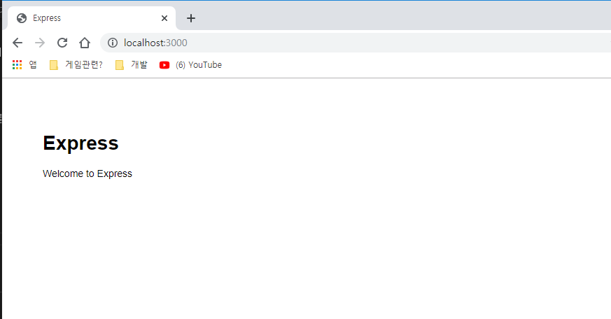
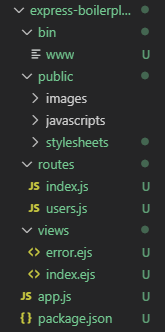

# express-generator
### express로 기본 애플리케이션(보일러플레이트)을 만들어주는 모듈 사용방법

1. express-generator 모듈 설치
```bash 
$ npm install express-generator -g 
```
2. view engine을 ejs로 설정하고 express-bolierplate라는 폴더에 기본 애플리케이션을 만든다.
```bash
$ express --view=ejs express-boilerplate
```
3. 폴더 이동 후 모듈 설치(package.json에 포함 된 모듈)
```bash
$ cd express-boilerpalte
$ npm inastall
```
4. 실행
``` bash
$ npm run start
> express-boilerplate@0.0.0 start C:\Users\whgus\Desktop\express-generator\express-boilerplate
> node ./bin/www
```
5. http://locahost:3000 으로 접속


### 폴더 구조


### express 명령어 옵션
```bash
$ express --help

  Usage: express [options][dir]

  Options:

    -h, --help          output usage information
        --version       output the version number
    -e, --ejs           add ejs engine support
        --hbs           add handlebars engine support
        --pug           add pug engine support
    -H, --hogan         add hogan.js engine support
        --no-view       generate without view engine
    -v, --view <engine> add view <engine> support (ejs|hbs|hjs|jade|pug|twig|vash) (defaults to jade)
    -c, --css <engine>  add stylesheet <engine> support (less|stylus|compass|sass) (defaults to plain css)
        --git           add .gitignore
    -f, --force         force on non-empty directory
```